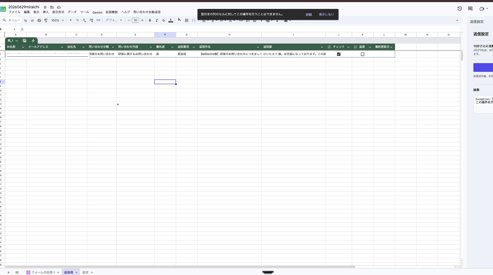
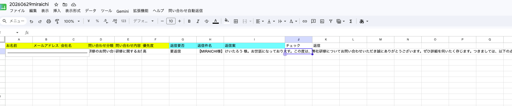
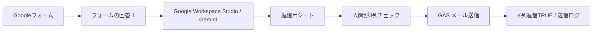

# 問い合わせ自動返信 GAS

Googleフォームの問い合わせを起点に、Google Workspace Studio / Gemini で返信案を作り、人間が確認したものだけ Google Apps Script からメール送信するサンプルです。

## 公開期間

このリポジトリは配布用の一時公開を想定しています。

- 公開期間: **2026年6月30日 から 2026年7月7日 まで**（Asia/Tokyo）
- 利用したい方は、**公開から1週間以内にフォークしてください。**
- **1週間以内にフォークください。**

## 資料配布ページ

スライドPDF、解説動画、Google Workspace Studioプロンプト、サンプルリンクを1ページにまとめています。

- 配布ページ: [https://material-site-sage.vercel.app](https://material-site-sage.vercel.app)
- 解説動画: [https://youtu.be/ADuaOgSNXAA](https://youtu.be/ADuaOgSNXAA)
- スライドPDF: 配布ページ内で閲覧・ダウンロードできます。
- プロンプト: 配布ページ内のコードブロック、または `workspace-studio-prompt.md` をコピーしてください。
- 特典配布テンプレート: イベントカバー、講師プロフィール、X、note、公式LINE枠、書籍リンクを含めています。

## できること

- スプレッドシートにカスタムメニュー `問い合わせ自動返信` を追加
- Googleフォームを作成し、回答先を現在のスプレッドシートに設定
- Googleフォーム標準の `フォームの回答 1` を原本として利用
- Google Workspace Studio で問い合わせ内容を分類し、返信案を `返信用` シートへ追加
- 人間が `返信用` シートのJ列 `チェック` をTRUEにした行だけメール送信
- 送信成功後にK列 `返信` をTRUE、L列 `最終更新日時` を更新
- 15分ごとの自動送信トリガーON/OFF
- サイドバーから即時送信
- ヘルプDialogで運用手順を確認
- `送信ログ` シートへ成功/失敗を記録

## 画面イメージ

### 返信用シートと送信サイドバー



### 返信用シートのキュー



### Google Workspace Studio のプロンプト入力


スクリーンショットは公開用に一部の個人情報をマスクしています。

## 全体アーキテクチャ



## シート構成

### フォームの回答 1

Googleフォーム標準の回答シートです。GASでは独自の問い合わせ管理シートを作りません。

### 返信用

Workspace Studio が行を追加し、人間が送信可否を確認するシートです。

| 列 | 見出し | 役割 |
| --- | --- | --- |
| A | お名前 | フォーム回答から転記 |
| B | メールアドレス | 宛先 |
| C | 会社名 | フォーム回答から転記 |
| D | 問い合わせ分類 | Geminiの分類またはフォーム値 |
| E | 問い合わせ内容 | フォーム回答から転記 |
| F | 優先度 | `高` / `中` / `低` |
| G | 返信要否 | `要返信` / `返信不要` / `要確認` |
| H | 返信件名 | メール件名 |
| I | 返信案 | メール本文 |
| J | チェック | 人間が確認後にTRUE |
| K | 返信 | GASが送信成功後にTRUE |
| L | 最終更新日時 | 送信成功日時 |

### 送信ログ

GASのメール送信結果を記録します。

| 列 | 見出し |
| --- | --- |
| A | 日時 |
| B | 行番号 |
| C | 宛先 |
| D | 件名 |
| E | 結果 |
| F | 詳細 |

## セットアップ

### 1. リポジトリをフォーク

公開期間内にこのリポジトリをフォークしてください。

```bash
git clone https://github.com/YOUR_ACCOUNT/REPO_NAME.git
cd REPO_NAME
```

### 2. Apps Script プロジェクトを用意

Googleスプレッドシートにコンテナバインドされた Apps Script プロジェクトを作成し、Script ID を取得します。

### 3. clasp 設定

`.clasp.example.json` を参考に、ローカル専用の `.clasp.json` を作成します。

```json
{
  "scriptId": "YOUR_APPS_SCRIPT_ID",
  "rootDir": "src"
}
```

`.clasp.json` はローカル専用です。公開リポジトリにはコミットしないでください。

### 4. clasp ログイン

```bash
clasp login
clasp push -f
```

### 5. スプレッドシート側で初期設定

スプレッドシートを再読み込みして、メニューから実行します。

```text
問い合わせ自動返信 > 初期設定
```

初回はGoogleの権限承認が必要です。

## Google Workspace Studio の設定

`workspace-studio-prompt.md` のプロンプトをGeminiステップに貼り付けます。

推奨フロー:

1. 開始条件: Googleフォームの回答が届いたとき
2. Geminiに相談: フォーム回答をJSON化
3. 抽出: JSONキーを個別の値に抽出
4. 行を追加: `返信用` シートへ追加

抽出キー:

| JSONキー | 返信用シート列 |
| --- | --- |
| `name` | A列 |
| `email` | B列 |
| `company` | C列 |
| `category` | D列 |
| `inquiry_body` | E列 |
| `priority` | F列 |
| `reply_required` | G列 |
| `reply_subject` | H列 |
| `reply_draft` | I列 |
| `approval_checked` | J列 |
| `sent` | K列 |
| `updated_at` | L列 |

`approval_checked` と `sent` はGemini側では必ず `false` にします。送信してよい内容だけ、人間がJ列をTRUEにしてください。

## メール送信の条件

GASは次の条件をすべて満たす行だけ送信します。

- G列 `返信要否` が `要返信`
- J列 `チェック` がTRUE
- K列 `返信` がFALSEまたは空欄
- B列 `メールアドレス` が空でない
- H列 `返信件名` が空でない
- I列 `返信案` が空でない

送信に成功すると、K列がTRUEになり、L列に送信日時が入ります。

## サイドバー

```text
問い合わせ自動返信 > 送信設定を開く
```

サイドバーで以下を操作できます。

- 15分ごとの自動送信トリガーON/OFF
- 承認済み行の即時送信
- 直近の送信結果確認

## ヘルプDialog

```text
問い合わせ自動返信 > ヘルプ
```

スプレッドシート上で、運用フロー、列定義、送信されない場合の確認ポイントを表示します。

## 注意事項

- このサンプルは配布用テンプレートです。実運用前に必ずテスト用アドレスで送信確認してください。
- メール送信はApps Scriptを実行したGoogleアカウントから行われます。
- Google Workspace Studio の出力は人間が確認し、J列をTRUEにしたものだけ送信してください。
- スクリーンショットや設定ファイルに個人情報、APIキー、認証情報を含めないでください。

## ファイル構成

```text
src/
  Code.gs
  Sidebar.html
  HelpDialog.html
  appsscript.json
workspace-studio-prompt.md
要件定義.md
docs/images/
```

## ライセンス

短期配布用サンプルです。公開期間内にフォークして、各自の環境で調整してください。
